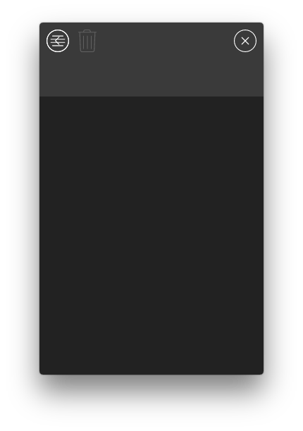

# Electron Music Player Tutorial

## Table of Contents

1. [Introduction](#intro)
1. [What we'll be creating](#showcase)
1. [What we'll need](#dependencies)
1. [Setting up our app](#appSetup)
    1. [Cleanup package.json](#appSetupCleanPackage)
    1. [Cleanup app](#appSetupCleanApp)
    1. [Cleanup index.js](#appSetupCleanIndex)
1. [Appropriate window](#appropriateWindow)
1. [Styling the window](#stylingWindow)
1. [Let's fix more styles](#fixTitleStyles)
1. [Creating actions and a store](#creatingActionsAndAStore)
    1. [Event dispatcher](#eventDispatcher)
    1. [App store](#appStore)
    1. [App events](#appEvents)
    1. [App actions](#appActions)
    1. [Making it work](#appMakingItWork)
1. [Building the play list](#playList)
    1. [List Action](#listAction)
    1. [Music Action](#musicAction)
    1. [SortableList Component](#sortableListComponent)
    1. [SortableListItem Component](#sortableListItemComponent)
    1. [SortableList and SortableListItem styles](#sortableListStyles)
    1. [Adding Events to the Store](#listComponentStoreEvents)
    1. [List Component](#listComponent)
    1. [Back to the store](#backToTheStore)
    1. [Adding more to the store](#moreToTheStore)
1. [Creating the drop area](#dropArea)
    1. [Drop Area Actions](#dropAreaActions)
    1. [Drop Area Utils](#dropAreaUtils)
    1. [Drop Area Component](#dropAreaComponent)
    1. [Fixing Current Styles](#fixingCurrentStyles)
1. [Adding files to the list](#addingFilesToTheList)

## Introduction<a name="intro"></a>

I'm here today to teach you how to build a electron music player, if you follow my steps you should get a cool
looking mp3 player based on [Lucas Bebber](https://twitter.com/lucasbebber) gooey example posted on [codrops](http://tympanus.net/Development/CreativeGooeyEffects/player.html).

I'll be providing some music created by my friend [Fábio Guedes](https://jp.linkedin.com/in/fábio-guedes-16a96ba5/en)

Check his work on [Spotify](https://open.spotify.com/user/dawnclover) and here's a complete [album](https://open.spotify.com/album/5QSA8n0IzZHsMgciol0g9m).

All the provided icons used in this app were taken from [flat icon](http://www.flaticon.com/) and they were all made by [Madebyoliver](http://www.flaticon.com/authors/madebyoliver)

Please check the [dependencies list](#dependencies) to check where they came from.

*PS: We won't care about windows for this tutorial. We'll be focused in getting it to work on OSX, but it should be the same for windows.*


## What we'll be creating<a name="showcase"></a>


## What we'll need<a name="dependencies"></a>

1. [Electron React Boilerplate](https://github.com/chentsulin/electron-react-boilerplate)
1. [Essential Set](http://www.flaticon.com/packs/essential-set-2)
1. [Essential Compilation](http://www.flaticon.com/packs/essential-compilation)
1. [Essential Collection](http://www.flaticon.com/packs/essential-collection)

## Setting up our app<a name="appSetup"></a>

Go ahead and download or clone [Electron React Boilerplate](https://github.com/chentsulin/electron-react-boilerplate)

### Cleanup package.json<a name="appSetupCleanPackage"></a>

Change the package name and all the related information to the product.

Now we'll remove unnecessary dependencies
```
// Found in devDependencies
"redux-logger": "^2.6.1",

// Found in dependencies
"react-redux": "^4.4.5",
"react-router": "^2.6.0",
"react-router-redux": "^4.0.5",
"redux": "^3.5.2",
"redux-thunk": "^2.1.0",
```

Here's how the [package.json should look](https://github.com/DPr00f/electron-music-player-tutorial/blob/ff23691b5ef579c5f6702a8c54f3dc40ddc65967/package.json)

### Cleanup app<a name="appSetupCleanApp"></a>

Locate the app folder and remove all files and folders, leaving only

- app.html
- app.icns
- app.global.css
- index.js

Here's what you should endup with


### Cleanup index.js<a name="appSetupCleanIndex"></a>
Locate `app/index.js` and clean it up as follows

```
import React from 'react';
import { render } from 'react-dom';
import './app.global.css';

render(
  <div>
    <h1>Hello world</h1>
  </div>,
  document.getElementById('root')
);
```
[Link to app/index.js](https://github.com/DPr00f/electron-music-player-tutorial/blob/ff23691b5ef579c5f6702a8c54f3dc40ddc65967/app/index.js)

Now we are ready to test the app and see if everything went fine

On your terminal run
`npm install`

When that's done execute
`npm run dev`

If everything goes well you should see this


*Ignore the error in the console, everything works fines*


## Appropriate window<a name="appropriateWindow"></a>

[If you remember](#showcase), the window that we used for the project seems customized

Let's do it now

Open `main.development.js`
Locate `app.on('ready', async () => {`

In that block of code you can see a `mainWindow` variable
Replace it with
```
mainWindow = new BrowserWindow({
    show: false,
    width: 318,
    height: 500,
    frame: false,
    resizable: process.env.NODE_ENV === 'development'
});
```

Save the file and if you don't see any changes rerun `npm run dev` from the command line

Since the window is too small we don't want to open the dev tools by default, but we still want to access it if in development.

Locate the line that says `mainWindow.openDevTools();` and remove it.

From now on if we want to access the dev tools we just need to right click on the page and select inspect element.

*There were some other changes made in `main.development.js` please check the [diff file](https://github.com/DPr00f/electron-music-player-tutorial/commit/5dc63c001229e265d6fdcfcf263992ff3f31162c#diff-6e4ea414b6f64bc7192a16c10fe2e496L1) to see them. They relate to changes in the menu and tray*

## Styling the window<a name="stylingWindow"></a>


Your window should look as the image above, obviously, since we have no title bar we can no longer drag it.
Let's start styling it and add a dragging area to it.

To avoid errors down the line we'll need to install a webpack image loader
`npm i image-webpack-loader -D`

And on `webpack.config.base.js` we'll add
```
{
    test: /\.(jpe?g|png|gif|svg)$/i,
    loaders: [
    'file?hash=sha512&digest=hex&name=[hash].[ext]',
    'image-webpack?bypassOnDebug&optimizationLevel=10&interlaced=false'
    ]
}
```

This way all our css will load the images correctly

Let's create our first component `app/components/Home.js`

```
import React, { Component } from 'react';
import styles from './Home.css';

export default class Home extends Component {
    constructor() {
        super();
        this.onCloseClick = this.onCloseClick.bind(this);
        this.onMenuClick = this.onMenuClick.bind(this);
    }

    onMenuClick() {
        alert('MENU');
    }

    onCloseClick() {
        alert('CLOSE');
    }

    render() {
        let className = styles.homeContainer;
        return (
            <div className={ className }>
                <div className={ styles.playerTitle }>
                    <div className={ styles.closeButton } onClick={this.onCloseClick}></div>
                    <div className={ styles.menuButton } onClick={this.onMenuClick}></div>
                </div>
            </div>
        );
    }
}
```

Please note that we don't have a `Home.css` yet, let's create one at `app/components/Home.css`

```
.homeContainer {
  -webkit-filter: blur(0);
  filter: blur(0);
  -webkit-transition: all 0.3s;
  -moz-transition: all 0.3s;
  transition: all 0.3s;
}

.fileListOpened {
  -webkit-filter: blur(3px);
  filter: blur(3px);
}

.filesOver {
  -webkit-filter: blur(10px);
  filter: blur(10px);
}

.playerTitle {
  height: 105px;
  background: #3a3a3a;
  -webkit-user-select: none;
  -webkit-app-region: drag;
}

.menuButton {
  position: absolute;
  left: 10px;
  top: 10px;
  background: url("../assets/img/menu.svg");
  background-size: 100%;
  cursor: pointer;
  width: 32px;
  height: 32px;
  -webkit-app-region: no-drag;
}

.closeButton {
  position: absolute;
  right: 10px;
  top: 10px;
  background: url("../assets/img/close.svg");
  background-size: 100%;
  cursor: pointer;
  width: 32px;
  height: 32px;
  -webkit-app-region: no-drag;
}
```

We now need to update the `index.js`

```
import React from 'react';
import { render } from 'react-dom';
import Home from './components/Home';
import './app.global.css';

render(
  <Home />,
  document.getElementById('root')
);
```

At this point if we re-run the app we should see something like


The app is draggable now from the gray area. And when the buttons are clicked an alert should pop with `CLOSE` or `MENU` written on it.

*If you encountered any errors please double check that the path to images is correct and that the [webpack.config.base.js](webpack.config.base.js) contains the right loaders*

## Let's fix more styles<a name="fixTitleStyles"></a>

For starters let's remove the border around the gray area

On `app/app.global.css` let's replace all it's contents with

```
body {
  position: relative;
  color: white;
  height: 100vh;
  background-color: #222222;
  padding: 0;
  margin: 0;
  font-family: sans-serif;
}
```

## Creating actions and a store<a name="creatingActionsAndAStore"></a>

Time to get those buttons to work.

### Event dispatcher<a name="eventDispatcher"></a>

Create a new file `app/dispatcher/index.js`

```
import { Dispatcher } from 'flux';

class ApplicationDispatcher extends Dispatcher {
}

export default new ApplicationDispatcher();
```

That's all we need but we need to install flux, so from the command line type in `npm i flux -D`

`npm i flux -D` translates to `npm install flux --save-dev`

### App store<a name="appStore"></a>

Let's generate the store, create a new file `app/store/index.js`

```
import Dispatcher from '../dispatcher';
import { remote } from 'electron';
import EventEmitter from 'events';

class Store extends EventEmitter {
  closeCurrentWindow() {
    remote.getCurrentWindow().close();
  }

  openListMenu() {
      alert('Open List menu');
  }
}

const store = new Store();

Dispatcher.register((action) => {
  switch (action.actionType) {
    default:
      break;
  }
});

export default store;
```

You can tell that we are handling the close button already but it won't work just yet.

We need events and an action to trigger those events

### App events<a name="appEvents"></a>

Create a new file `app/events/index.js`

```
export const CLOSE_WINDOW = 'CLOSE_WINDOW';
export const OPEN_LIST = 'OPEN_LIST';
export const CLOSE_LIST = 'CLOSE_LIST';
```

### App actions<a name="appActions"></a>

One more file... `app/actions/home.js`

```
import Dispatcher from '../Dispatcher';
import { CLOSE_WINDOW, OPEN_LIST } from '../events';

export default {
  closeWindow: () => {
    Dispatcher.dispatch({
      actionType: CLOSE_WINDOW
    });
  },

  openList: () => {
    Dispatcher.dispatch({
      actionType: OPEN_LIST
    });
  }
};
```

### Making it work<a name="appMakingItWork"></a>

All these changes and it still doesn't work right?

Let's fix that then

Open `app/components/Home.js` and let's start

Import the home actions and call it in the close button

```
import HomeActions from '../actions/home';

...

    onMenuClick() {
        HomeActions.openList();
    }

    onCloseClick() {
        HomeActions.closeWindow();
    }

...
```

Now let's open `app/store/index`

Where we register the Dispatcher events let's make sure it looks like the following

```
Dispatcher.register((action) => {
  switch (action.actionType) {
    case CLOSE_WINDOW:
      store.closeCurrentWindow();
      break;

    case OPEN_LIST:
      store.openListMenu();
      break;

    default:
      break;
  }
});
```

Also we need to make sure that we're importing those events

```
import { CLOSE_WINDOW, OPEN_LIST } from '../events';
```

Nothing will happen if we run the app now because the store is not being imported anywhere,
so let's open `app/index.js` and import the store.

```
import React from 'react';
import { render } from 'react-dom';
import Home from './components/Home';
import './app.global.css';
import './store';

render(
  <Home />,
  document.getElementById('root')
);
```

If everything went fine you should be able to click the close button and the window will close.
Also if you click on the list button you'll see a new alert saying "Open List menu"

If something went wrong you won't be seeing any content on the page, make sure you check any potential erros on the console.

## Building the play list<a name="playList></a>

Let's start by adding our new component to `app/index.js`

```
import React from 'react';
import { render } from 'react-dom';
import Home from './components/Home';
import List from './components/List';
import './app.global.css';
import './store';

render(
  <div>
     <Home />
     <List />
  </div>,
  document.getElementById('root')
);
```

Let's add more events to `app/events/index.js`

```
export const CLOSE_WINDOW = 'CLOSE_WINDOW';
export const OPEN_LIST = 'OPEN_LIST';
export const CLOSE_LIST = 'CLOSE_LIST';
export const REORDER_LIST = 'REORDER_LIST';
export const DRAGGING_FILES = 'DRAGGING_FILES';
export const NOT_DRAGGING_FILES = 'NOT_DRAGGING_FILES';
export const DROP_FILES = 'DROP_FILES';
export const REMOVE_FROM_LIST = 'REMOVE_FROM_LIST';
export const LIST_UPDATE = 'LIST_UPDATE';
export const STARTED_PLAYING = 'STARTED_PLAYING';
export const STOPPED_PLAYING = 'STOPPED_PLAYING';
export const RESTART_SONG = 'RESTART_SONG';
export const PLAY_SONG = 'PLAY_SONG';
export const PAUSE_SONG = 'PAUSE_SONG';
export const PLAY_NEXT_SONG = 'PLAY_NEXT_SONG';
export const PLAY_PREVIOUS_SONG = 'PLAY_PREVIOUS_SONG';
export const MUTE_SOUND = 'MUTE_SOUND';
export const UNMUTE_SOUND = 'UNMUTE_SOUND';
export const SET_VOLUME = 'SET_VOLUME';
export const SEEK_SONG = 'SEEK_SONG';
export const ANIMATION_FRAME = 'ANIMATION_FRAME'; // We'll use this at the very end of the tutorial (All the other events are self explanatory)
```

Those are all the events that we need to finish the app so we can close that file forever

Let's create a couple of more actions that will control the list and future events like play, pause, next song, previous song

### List Action<a name="listAction"></a>

Let's create `app/actions/list.js`

```
import Dispatcher from '../dispatcher';
import { CLOSE_LIST, REORDER_LIST, REMOVE_FROM_LIST } from '../events';

export default {
  closeList: () => {
    Dispatcher.dispatch({
      actionType: CLOSE_LIST
    });
  },

  reorderedList: (newList) => {
    Dispatcher.dispatch({
      actionType: REORDER_LIST,
      list: newList
    });
  },

  removeFromList: (ids) => {
    Dispatcher.dispatch({
      actionType: REMOVE_FROM_LIST,
      ids
    });
  }
};
```

### Music Action<a name="musicAction"></a>

Let's create another file `app/actions/music.js`

```
import Dispatcher from '../dispatcher';
import {
  PLAY_SONG,
  PAUSE_SONG,
  PLAY_NEXT_SONG,
  PLAY_PREVIOUS_SONG,
  SEEK_SONG,
  MUTE_SOUND,
  UNMUTE_SOUND,
  SET_VOLUME,
  RESTART_SONG
} from '../events';

export default {
  playSong: (song) => {
    Dispatcher.dispatch({
      actionType: PLAY_SONG,
      song
    });
  },

  pauseSong: (song) => {
    Dispatcher.dispatch({
      actionType: PAUSE_SONG,
      song
    });
  },

  mute: () => {
    Dispatcher.dispatch({
      actionType: MUTE_SOUND
    });
  },

  unmute: (savedVolume = 100) => {
    Dispatcher.dispatch({
      actionType: UNMUTE_SOUND,
      volume: savedVolume
    });
  },

  setVolume: (volume) => {
    Dispatcher.dispatch({
      actionType: SET_VOLUME,
      volume
    });
  },

  restartSong: () => {
    Dispatcher.dispatch({
      actionType: RESTART_SONG
    });
  },

  playPreviousSong: () => {
    Dispatcher.dispatch({
      actionType: PLAY_PREVIOUS_SONG
    });
  },

  playNextSong: () => {
    Dispatcher.dispatch({
      actionType: PLAY_NEXT_SONG
    });
  },

  seek: (value) => {
    Dispatcher.dispatch({
      actionType: SEEK_SONG,
      value
    });
  }
};
```

Now that we have our actions, let's start with creating a `SortableList` component

### SortableList Component<a name="sortableListComponent"></a>

let's create it `app/components/SortableList.js`

```
import React, { Component } from 'react';
import store from '../store';
import styles from './SortableList.css';
import SortableListItem from './SortableListItem';
import {
  DRAGGING_FILES,
  NOT_DRAGGING_FILES
} from '../events';

class SortableList extends Component {
  constructor(props) {
    super();
    this.state = {
      draggingIndex: null,
      data: props.data,
      draggingFilesOver: false
    };
    this.onStateUpdate = this.onStateUpdate.bind(this);
    this.onDragFilesStart = this.onDragFilesStart.bind(this);
    this.onDragFilesStop = this.onDragFilesStop.bind(this);
  }

  componentDidMount() {
    store.on(DRAGGING_FILES, this.onDragFilesStart);
    store.on(NOT_DRAGGING_FILES, this.onDragFilesStop);
  }

  componentWillUnmount() {
    store.removeListener(DRAGGING_FILES, this.onDragFilesStart);
    store.removeListener(NOT_DRAGGING_FILES, this.onDragFilesStop);
  }

  componentWillReceiveProps(newProps) {
    this.setState({
      data: newProps.data
    });
  }

  onStateUpdate(obj) {
    this.setState(obj);
    if (obj.data) {
      this.onComponentFinishedUpdating(obj.data);
    }
  }

  onComponentFinishedUpdating(data) {
    if (this.props.onListReorder) {
      this.props.onListReorder.call(null, data);
    }
  }

  onDragFilesStart() {
    this.setState({
      draggingFilesOver: true
    });
  }

  onDragFilesStop() {
    this.setState({
      draggingFilesOver: false
    });
  }

  render() {
    let className = styles.container;
    if (this.state.draggingFilesOver) {
      className += ` ${styles['has-filesOver']}`;
    }
    const listItems = this.state.data.map((item, i) => {
      return (
          <SortableListItem
              key={ i }
              isPlaying={ this.props.songPlaying && this.props.songPlaying.id === item.id }
              isPaused={ this.props.songPlaying && this.props.songPlaying.paused }
              selected={ this.props.selectedItems.indexOf(item.id) > -1 }
              updateState={ this.onStateUpdate }
              items={ this.state.data }
              draggingIndex={ this.state.draggingIndex }
              sortId={ i }
              outline="list"
              onPlayButtonClick={ this.props.onPlayButtonClick }
              onPauseButtonClick={ this.props.onPauseButtonClick }
              onClick={ this.props.toggleItem }
              className={ i % 2 === 0 ? 'is-even' : 'is-odd' }
              item={ item }/>
      );
    }, this);

    return (
          <div className={ className }>{ listItems }</div>
    );
  }
}

export default SortableList;
```

Take a minute to look at the code, we're missing a component called `SortableListItem`

### SortableListItem Component<a name="sortableListItemComponent"></a>

Let's add it `app/components/SortableListItem.js`

```
import React, { Component } from 'react';
import styles from './SortableListItem.css';
import { Sortable } from 'react-sortable';

class ListItem extends Component {
  constructor() {
    super();
    this.onPlayButtonClickProxy = this.onPlayButtonClickProxy.bind(this);
    this.onPauseButtonClickProxy = this.onPauseButtonClickProxy.bind(this);
    this.onClickProxy = this.onClickProxy.bind(this);
  }

  onPlayButtonClickProxy(e) {
    e.preventDefault();
    e.stopPropagation();
    const position = parseInt(e.target.parentNode.dataset.id, 10);
    if (this.props.onPlayButtonClick) {
      this.props.onPlayButtonClick.call(null, this.props.items[position]);
    }
  }

  onPauseButtonClickProxy(e) {
    e.preventDefault();
    e.stopPropagation();
    const position = parseInt(e.target.parentNode.dataset.id, 10);
    if (this.props.onPauseButtonClick) {
      this.props.onPauseButtonClick.call(null, this.props.items[position]);
    }
  }

  onClickProxy(e) {
    const position = parseInt(e.target.parentNode.dataset.id, 10);
    if (this.props.onClick) {
      this.props.onClick.call(null, this.props.items[position]);
    }
  }

  render() {
    let className = `${styles.item} ListItem__${this.props.className}`;
    if (this.props.selected) {
      className += ` ${styles['is-selected']}`;
    }
    if (this.props.isPlaying) {
      className += ` ${styles['is-playing']}`;
    }
    return <div
              data-id= { this.props['data-id'] }
              draggable={ this.props.draggable }
              onDragStart={ this.props.onDragStart }
              onDragEnd={ this.props.onDragEnd }
              onDragOver={ this.props.onDragOver }
              onTouchStart={ this.props.onTouchStart }
              onTouchMove={ this.props.onTouchMove }
              onTouchEnd={ this.props.onTouchEnd }
              onClick={ this.onClickProxy }
              className={ className }
          >
            <span className={ styles.itemNumber }></span>
            <span className={ styles.itemName }>{ this.props.item.displayName }</span>
            { !this.props.isPlaying || this.props.isPaused ?
                      <i className={ styles.playButton } onClick={ this.onPlayButtonClickProxy }></i> :
                      <i className={ styles.pauseButton } onClick={ this.onPauseButtonClickProxy }></i>
            }
          </div>;
  }
}

export default Sortable(ListItem);
```

This component will take care of a single item on the list, but it requires another npm module called `react-sortable`.

Let's add it by executing `npm i react-sortable -D` from the command line

We've didn't add the styles for the components.

Let's add them now

### SortableList and SortableListItem styles<a name="sortableListStyles"></a>

`app/components/SortableListItem.css`

```
.item {
  counter-increment: item-counter;
  position: relative;
  height: 60px;
  -webkit-user-select: none;
}

.item:hover .itemNumber {
  opacity: 0;
}

.item:hover .playButton {
  opacity: 1;
}

.item.is-playing .itemNumber{
  opacity: 0;
}

.item.is-playing .playButton{
  opacity: 1;
}

.playButton {
  opacity: 0;
  position: absolute;
  left: 10px;
  top: 15px;
  background: url("../assets/img/play.svg");
  background-size: 100%;
  cursor: pointer;
  width: 32px;
  height: 32px;
  -webkit-app-region: no-drag;
  -webkit-transition: all 0.3s;
  -moz-transition: all 0.3s;
  transition: all 0.3s;
}

.pauseButton {
  position: absolute;
  left: 10px;
  top: 15px;
  background: url("../assets/img/pause.svg");
  background-size: 100%;
  cursor: pointer;
  width: 32px;
  height: 32px;
  -webkit-app-region: no-drag;
}

.itemNumber {
  opacity: 1;
  font-size: 18px;
  position: absolute;
  display: block;
  left: 18px;
  top: 0;
  line-height: 60px;
  color: #9d9d9d;
  -webkit-transition: all 0.3s;
  -moz-transition: all 0.3s;
  transition: all 0.3s;
}

.itemNumber::before {
  content: counter(item-counter) ".";
}

.itemName {
  display: block;
  width: 80%;
  white-space: nowrap;
  text-overflow: ellipsis;
  line-height: 60px;
  text-indent: 50px;
  font-size: 16px;
  font-weight: normal;
  overflow: hidden;
}

.is-selected {
  background: rgba(255, 255, 255, 0.3) !important;
}
```

And another one for `app/components/SortableList.css`

```
.container {
  position: absolute;
  top: 105px;
  bottom: 0;
  left: 0;
  right: 0;
  overflow: auto;
  counter-reset: item-counter;
  -webkit-filter: blur(0);
  filter: blur(0);
  -webkit-transition: all 0.3s;
  -moz-transition: all 0.3s;
  transition: all 0.3s;
}

.has-filesOver {
  -webkit-filter: blur(2px);
  filter: blur(2px);
}
```

The `SortableList` and `SortableListItem` are now done, but we're still missing the `List` component, but before jumping into that, let's register the events to the store.

### Adding Events to the Store<a name="listComponentStoreEvents"></a>

Let's open `app/store/index.js`

```
// Replace the events that we had before with
import {
    CLOSE_WINDOW,
    OPEN_LIST,
    DRAGGING_FILES,
    NOT_DRAGGING_FILES
} from '../events';

...

// Let's register those events

Dispatcher.register((action) => {
  switch (action.actionType) {
    case DRAGGING_FILES:
      store.emit(DRAGGING_FILES);
      break;

    case NOT_DRAGGING_FILES:
      store.emit(NOT_DRAGGING_FILES);
      break;

    case CLOSE_WINDOW:
      store.closeCurrentWindow();
      break;

...
```

We're forcing the store to emit the same value, which means that other components will listen to those events and perform changes to their state.

If you take a look at the [showcase gif](#showcase) again, you'lll notice that when the files get dragged over the player, the background elements blur, and that's what these 2 events (`DRAGGING_FILES` and `NOT_DRAGGING_FILES`) will helps achieve.

One example of this is the `SortableList` Component.

### List Component<a name="listComponent"></a>

Create a file `app/components/List.js`

```
import React, { Component } from 'react';
import store from '../store';
import ListActions from '../actions/list';
import MusicActions from '../actions/music';
import styles from './List.css';
import SortableList from './SortableList';
import {
  OPEN_LIST,
  CLOSE_LIST,
  LIST_UPDATE,
  STARTED_PLAYING,
  STOPPED_PLAYING
} from '../events';

const KEYCODE_ESC = 27;

export default class List extends Component {
  constructor() {
    super();
    this.onOpenList = this.onOpenList.bind(this);
    this.onCloseList = this.onCloseList.bind(this);
    this.onListUpdate = this.onListUpdate.bind(this);
    this.onBackButtonClicked = this.onBackButtonClicked.bind(this);
    this.onRubbishButtonClicked = this.onRubbishButtonClicked.bind(this);
    this.onPlayButtonClick = this.onPlayButtonClick.bind(this);
    this.onPauseButtonClick = this.onPauseButtonClick.bind(this);
    this.onListReorder = this.onListReorder.bind(this);
    this.onSongPlaying = this.onSongPlaying.bind(this);
    this.onSongStopped = this.onSongStopped.bind(this);
    this.toggleItem = this.toggleItem.bind(this);
    this.onKeyUp = this.onKeyUp.bind(this);
    this.state = {
      opened: false,
      list: store.getList(),
      draggingIndex: null,
      draggingFilesOver: false,
      selectedItems: [],
      songPlaying: null
    };
  }

  componentDidMount() {
    store.on(OPEN_LIST, this.onOpenList);
    store.on(CLOSE_LIST, this.onCloseList);
    store.on(LIST_UPDATE, this.onListUpdate);
    store.on(STARTED_PLAYING, this.onSongPlaying);
    store.on(STOPPED_PLAYING, this.onSongStopped);
    document.addEventListener('keyup', this.onKeyUp);
  }

  componentWillUnmount() {
    store.removeListener(OPEN_LIST, this.onOpenList);
    store.removeListener(CLOSE_LIST, this.onCloseList);
    store.removeListener(LIST_UPDATE, this.onListUpdate);
    store.removeListener(STARTED_PLAYING, this.onSongPlaying);
    store.removeListener(STOPPED_PLAYING, this.onSongStopped);
    document.removeEventListener('keyup', this.onKeyUp);
  }

  onOpenList() {
    this.setState({
      opened: true
    });
  }

  onCloseList() {
    this.setState({
      opened: false
    });
  }

  onListUpdate() {
    this.setState({
      list: store.getList()
    });
  }

  onSongPlaying() {
    this.setState({
      songPlaying: store.getSongPlaying()
    });
  }

  onSongStopped() {
    this.setState({
      songPlaying: null
    });
  }

  onKeyUp(e) {
    if (this.state.opened && e.keyCode === KEYCODE_ESC) {
      ListActions.closeList();
    }
  }

  onBackButtonClicked() {
    ListActions.closeList();
  }

  onRubbishButtonClicked() {
    if (!this.state.selectedItems) {
      return;
    }
    ListActions.removeFromList(this.state.selectedItems);
    this.setState({
      selectedItems: []
    });
  }

  onPlayButtonClick(file) {
    MusicActions.playSong(file);
  }

  onPauseButtonClick() {
    MusicActions.pauseSong();
  }

  onListReorder(newList) {
    ListActions.reorderedList(newList);
  }

  toggleItem(file) {
    const selectedItems = this.state.selectedItems;
    const index = selectedItems.indexOf(file.id);
    if (index > -1) {
      selectedItems.splice(index, 1);
    } else {
      selectedItems.push(file.id);
    }
    this.setState({
      selectedItems
    });
  }

  render() {
    let className = 'menuList';
    let rubbishButtonClassName = styles.rubbishButton;
    if (this.state.opened) {
      className += ' is-opened';
    }
    if (this.state.selectedItems.length) {
      rubbishButtonClassName += ` ${styles['is-active']}`;
    }
    return (
      <div className={ className }>
        <div className={ styles.backButton } onClick={ this.onBackButtonClicked }></div>
        <div className={ rubbishButtonClassName } onClick={ this.onRubbishButtonClicked }></div>
        { this.renderList() }
      </div>
    );
  }

  renderList() {
    return (
      <SortableList
          onListReorder={ this.onListReorder }
          onPlayButtonClick={ this.onPlayButtonClick }
          onPauseButtonClick={ this.onPauseButtonClick }
          toggleItem={ this.toggleItem }
          selectedItems={ this.state.selectedItems }
          songPlaying={ this.state.songPlaying }
          data={ this.state.list }
      />
    );
  }
}
```

and style it with `app/components/List.css`

```
.backButton {
  position: absolute;
  left: 10px;
  top: 10px;
  background: url("../assets/img/back.svg");
  background-size: 100%;
  cursor: pointer;
  width: 32px;
  height: 32px;
  -webkit-app-region: no-drag;
}

.rubbishButton {
  position: absolute;
  left: 52px;
  top: 10px;
  background: url("../assets/img/rubbish.svg");
  background-size: 100%;
  width: 32px;
  height: 32px;
  -webkit-app-region: no-drag;
  opacity: 0.2;
  -webkit-transition: all 0.3s;
  -moz-transition: all 0.3s;
  transition: all 0.3s;
}

.rubbishButton.is-active {
  opacity: 1;
  cursor: pointer;
}
```

At this point if we run the app an error will be thrown because store.getList() doesn't exist.

But let's fix that and see what we have so far

### Back to the store<a name="backToTheStore"></a>

If we change the store and add a `getList()` method the app will run

`app/store/index.js`

```
...
class Store extends EventEmitter {
  constructor() {
    super();
    this.songsList = [];
  }

  closeCurrentWindow() {
    remote.getCurrentWindow().close();
  }

  openListMenu() {
    alert('Open List menu');
  }

  getList() {
    return this.songsList;
  }
}
...
```

This is what we'll see



Not very appealing I know, but we'll fix it soon enough

### Adding more to the store<a name="moreToTheStore"></a>

Let's keep on going and add more events to the store that will actually help us identifying the song that is playing and reorder the musics

We'll add all the events this time and all the needed methods to finish the player and we'll complete them as we go along

`app/store/index.js`

```
// Events needed
import {
  CLOSE_WINDOW,
  REORDER_LIST,
  OPEN_LIST,
  CLOSE_LIST,
  DRAGGING_FILES,
  NOT_DRAGGING_FILES,
  DROP_FILES,
  REMOVE_FROM_LIST,
  LIST_UPDATE,
  STARTED_PLAYING,
  STOPPED_PLAYING,
  PLAY_SONG,
  PAUSE_SONG,
  PLAY_NEXT_SONG,
  PLAY_PREVIOUS_SONG,
  RESTART_SONG,
  SEEK_SONG,
  MUTE_SOUND,
  UNMUTE_SOUND,
  SET_VOLUME,
  ANIMATION_FRAME
} from '../events';

...

// All the incomplete methods contain a console log
class Store extends EventEmitter {
  constructor() {
    super();
    this.songsList = [];
    this.playingSong = null;
    this.volume = 100;
    this.isMute = false;
    this.onSongFinished = this.onSongFinished.bind(this);
  }

  closeCurrentWindow() {
    remote.getCurrentWindow().close();
  }

  openListMenu() {
    this.emit(OPEN_LIST);
  }

  addToList(files) {
    console.log('addToList: TODO');
  }

  removeFromList(ids) {
    this.songsList = this.songsList.filter((item) => (
      ids.indexOf(item.id) === -1
    ));
    this.emit(LIST_UPDATE);
  }

  getList() {
    return this.songsList;
  }

  replaceList(files) {
    this.songsList = files;
    this.emit(LIST_UPDATE);
  }

  getSongPlaying() {
    return this.playingSong;
  }

  getVolume() {
    return this.volume;
  }

  readMetaData(files) {
    console.log('readMetaData TODO');
  }

  playSong(file) {
    if (this.playingSong && this.playingSong.paused && (!file || this.playingSong.id === file.id)) {
      this.resumeSong();
    } else if (!file) {
      this.playNextOnTheList();
    } else {
      this.playingSong = file;
      console.log('playSong TODO');
      this.emit(STARTED_PLAYING, file);
    }
  }

  onSongFinished() {
    this.playNextOnTheList();
  }

  playNextOnTheList() {
    let i;
    if (!this.songsList.length) {
      return;
    }
    if (!this.playingSong) {
      this.playSong(this.songsList[0]);
    } else {
      for (i = 0; i < this.songsList.length; i++) {
        if (this.songsList[i].id === this.playingSong.id) {
          if (i + 1 >= this.songsList.length) {
            this.stopSong(this.playingSong);
          } else {
            this.playSong(this.songsList[i + 1]);
          }
          break;
        }
      }
    }
  }

  playPreviousOnTheList() {
    let i, songToPlay;
    if (!this.songsList.length) {
      return;
    }
    if (!this.playingSong) {
      this.playSong(this.songsList[0]);
    } else {
      for (i = 0; i < this.songsList.length; i++) {
        if (this.songsList[i].id === this.playingSong.id) {
          songToPlay = this.songsList[i - 1];
          if (i - 1 < 0) {
            songToPlay = this.songsList[this.songsList.length - 1];
          }
          this.playSong(songToPlay);
          break;
        }
      }
    }
  }

  resumeSong() {
    this.playingSong.paused = false;
    console.log('resumeSong TODO');
    this.emit(STARTED_PLAYING, this.playingSong);
  }

  pauseSong() {
    this.playingSong.paused = true;
    console.log('pauseSong TODO');
    this.emit(STARTED_PLAYING, this.playingSong);
  }

  stopSong(file) {
    if (!file) {
      return;
    }
    this.emit(STOPPED_PLAYING, this.playingSong);
    this.playingSong = null;
    console.log('stopSong TODO');
  }

  restartSong() {
    console.log('restartSong TODO');
  }

  isMuted() {
    return this.isMute;
  }

  mute() {
    this.isMute = true;
    console.log('mute TODO');
    this.emit(MUTE_SOUND);
  }

  unmute(volume) {
    this.isMute = false;
    console.log('unmute TODO');
    this.emit(UNMUTE_SOUND);
  }

  setVolume(volume) {
    console.log('setVolume TODO');
    this.volume = volume;
    this.emit(SET_VOLUME, volume);
  }

  getPlaytime() {
    console.log('getPlaytime TODO');
  }

  getSongDuration() {
    console.log('getSongDuration TODO');
  }

  seek(value) {
    console.log('seek TODO');
  }

  getFrequency() {
    console.log('getFrequency TODO');
  }
}

...

// Register the events

Dispatcher.register((action) => {
  switch (action.actionType) {
    case DRAGGING_FILES:
      store.emit(DRAGGING_FILES);
      break;

    case NOT_DRAGGING_FILES:
      store.emit(NOT_DRAGGING_FILES);
      break;

    case CLOSE_WINDOW:
      store.closeCurrentWindow();
      break;

    case OPEN_LIST:
      store.openListMenu();
      break;

    case CLOSE_LIST:
      store.emit(CLOSE_LIST);
      break;

    case REORDER_LIST:
      store.replaceList(action.list);
      break;

    case DROP_FILES:
      store.addToList(action.files);
      break;

    case REMOVE_FROM_LIST:
      store.removeFromList(action.ids);
      break;

    case PLAY_SONG:
      store.playSong(action.song);
      break;

    case PAUSE_SONG:
      store.pauseSong();
      break;

    case PLAY_NEXT_SONG:
      store.playNextOnTheList();
      break;

    case PLAY_PREVIOUS_SONG:
      store.playPreviousOnTheList();
      break;

    case MUTE_SOUND:
      store.mute();
      break;

    case UNMUTE_SOUND:
      store.unmute(action.volume);
      break;

    case SET_VOLUME:
      store.setVolume(action.volume);
      break;

    case RESTART_SONG:
      store.restartSong();
      break;

    case SEEK_SONG:
      store.seek(action.value);
      break;

    default:
      break;
  }
});

...
```

This is it, the store is pretty much done, we'll just change the needed methods from this point onwards

## Creating the drop area<a name="dropArea"></a>

Let's create the `DropArea` Component that will populate the list

To create the component we'll need some actions and helpers.

Let's start with the actions

### Drop Area Actions<a name="dropAreaActions"></a>

`app/actions/dropArea.js`

```
import Dispatcher from '../dispatcher';
import { DRAGGING_FILES, NOT_DRAGGING_FILES, DROP_FILES } from '../events';

export default {
  draggingFiles: () => {
    Dispatcher.dispatch({
      actionType: DRAGGING_FILES
    });
  },

  stopDraggingFiles: () => {
    Dispatcher.dispatch({
      actionType: NOT_DRAGGING_FILES
    });
  },

  addToList: (files) => {
    Dispatcher.dispatch({
      actionType: DROP_FILES,
      files
    });
  }
};
```

### Drop Area Utils<a name="dropAreaUtils"></a>

#### Better Drag

There seems to be a problem with the `dragenter`, `dragleave` events, this util will help us with that.

Create a file called `app/utils/BetterDrag.js`

```
import EventEmitter from 'events';

class BetterDrag extends EventEmitter {
  constructor(el) {
    super();
    this.el = el;
    this.dragCollection = [];
    this.onDragEnter = this.onDragEnter.bind(this);
    this.preventDefault = this.preventDefault.bind(this);
    this.onDragLeave = this.onDragLeave.bind(this);
    this.onDrop = this.onDrop.bind(this);
    this.addListeners();
  }

  addListeners() {
    this.el.addEventListener('dragover', this.preventDefault, false);
    this.el.addEventListener('dragenter', this.onDragEnter, false);
    this.el.addEventListener('dragleave', this.onDragLeave, false);
    this.el.addEventListener('drop', this.onDrop, false);
  }

  removeListeners() {
    this.el.removeEventListener('dragover', this.preventDefault);
    this.el.removeEventListener('dragenter', this.onDragEnter);
    this.el.removeEventListener('dragleave', this.onDragLeave);
    this.el.removeEventListener('drop', this.onDrop);
  }

  destroy() {
    this.removeListeners();
  }

  preventDefault(e) {
    e.preventDefault();
    e.stopPropagation();
  }

  onDragEnter(e) {
    this.preventDefault(e);
    if (this.dragCollection.length === 0) {
      this.emit('dragenter', e);
    }
    this.dragCollection.push(e.target);
  }

  onDragLeave(e) {
    this.preventDefault(e);
    setTimeout(() => {
      const currentElementIndex = this.dragCollection.indexOf(e.target);
      if (currentElementIndex > -1) {
        this.dragCollection.splice(currentElementIndex, 1);
      }

      if (this.dragCollection.length === 0) {
        this.emit('dragleave', e);
      }
    }, 1);
  }

  onDrop(e) {
    this.preventDefault(e);
    this.dragCollection = [];
    this.emit('dragleave', e);
    this.emit('drop', e);
  }
}

export default BetterDrag;
```

#### ReadFiles

Self explanatory, it will help us getting files info.

`app/utils/readFiles.js`

```
import fs from 'fs';
import File from './File';
import WaterFallOver from './WaterFallOver';

class ReadFiles {
  separateDirectoriesFromFiles(inputFiles) {
    const directories = [];
    const files = [];
    let i = 0;
    let file;
    let stat;
    for (i = 0; i < inputFiles.length; i++) {
      file = inputFiles[i];
      stat = fs.statSync(file.path);
      if (stat && stat.isDirectory()) {
        directories.push(file.path);
      } else {
        files.push(new File(file.path));
      }
    }
    return { directories, files };
  }

  getAllAvailableFiles(file) {
    return new Promise(resolve => {
      fs.stat(file, (err, stat) => {
        if (stat && stat.isDirectory()) {
          this.getAllFiles(file).then((res) => {
            resolve(res);
          });
        } else {
          file = new File(file);
          resolve([file]);
        }
      });
    });
  }

  getAllFiles(dir) {
    return new Promise(resolve => {
      let results = [];
      let waterFall, file;
      const onProcessDirectory = (obj) => {
        this.getAllFiles(obj.item).then(res => {
          results = results.concat(res);
          obj.next();
        });
      };
      const onProcessFile = (obj) => {
        file = `${dir}/${obj.item}`;
        this.getAllAvailableFiles(file).then((res) => {
          results = results.concat(res);
          obj.next();
        });
      };
      const onFinishedProcessing = () => {
        waterFall.removeListener('process', onProcessDirectory);
        waterFall.removeListener('process', onProcessFile);
        waterFall = null;
        resolve(results);
      };
      if (Array.isArray(dir)) {
        waterFall = new WaterFallOver(dir);
        waterFall.on('process', onProcessDirectory);
        waterFall.once('finish', onFinishedProcessing);
        waterFall.execute();
      } else {
        fs.readdir(dir, (err, files) => {
          waterFall = new WaterFallOver(files);
          waterFall.on('process', onProcessFile);
          waterFall.once('finish', onFinishedProcessing);
          waterFall.execute();
        });
      }
    });
  }

  filterFilesByType(files, type) {
    return files.filter((file) => (
      file.type.indexOf(type) > -1
    ));
  }
}

export default new ReadFiles();
```

#### File

A helper that will contain information about the loaded files, such as the mime type, album cover.

We'll need 3 new npm modules to get this information.

- [mime](https://www.npmjs.com/package/mime)
- [jsmediatags](https://www.npmjs.com/package/jsmediatags)
- [album-art](https://www.npmjs.com/package/album-art)

Please refer to the links above if you need extra information about them

Let's install them executing command `npm i mime jsmediatags album-art -S`

Here's the file `app/utils/File.js`

```
import p from 'path';
import mime from 'mime';
import jsmediatags from 'jsmediatags';
import albumArt from 'album-art';
import request from 'request';

class File {
  constructor(path) {
    this.path = path;
    this.name = p.basename(path);
    this.type = mime.lookup(path);
  }

  set id(value) {
    this._id = value;
  }

  get id() {
    return this._id;
  }

  set tag(value) {
    if (typeof value === 'string') {
      this.title = value;
      this.displayName = value;
    } else {
      this.artist = value.artist;
      this.title = value.title;
      this.picture = value.picture;
      this.album = value.album;
      this.displayName = `${value.artist} - ${value.title}`;
    }
  }

  get cover() {
    if (this._cover) {
      return this._cover;
    }
    if (!this._cover && this.picture) {
      const pic = this.picture;
      this._cover = `data:${pic.format};base64,${Buffer.from(pic.data).toString('base64')}`;
      return this._cover;
    }
    return false;
  }

  set cover(value) {
    this._cover = value;
  }

  readTags() {
    return new Promise(resolve => {
      new jsmediatags.Reader(this.path)
            .setTagsToRead(['title', 'artist', 'album', 'picture'])
            .read({
              onSuccess: (tag) => {
                this.tag = tag.tags;
                resolve();
              },
              onError: () => {
                this.tag = this.name;
                resolve();
              }
            });
    });
  }

  searchAlbumArt(...args) {
    return new Promise((resolve, reject) => {
      albumArt(...args, (err, url) => {
        if (!err && url) {
          resolve(url);
        } else {
          reject(err);
        }
      });
    });
  }

  findCover() {
    return new Promise((resolve, reject) => {
      this.searchAlbumArt(this.artist, this.album, 'large').then(url => {
        this.cover = url;
        this.convertCoverToBase64();
        resolve(url);
      }).catch(() => {
        this.searchAlbumArt(this.artist, null, 'large').then(url => {
          this.cover = url;
          this.convertCoverToBase64();
          resolve(url);
        }).catch(() => {
          reject();
        });
      });
    });
  }

  convertCoverToBase64() {
    request.get({
      uri: this.cover,
      encoding: null
    }, (err, response, body) => {
      if (!err && response.statusCode >= 200 && response.statusCode < 400) {
        const type = response.headers['content-type'];
        const base64Body = new Buffer(body).toString('base64');
        this.cover = `data:${type};base64,${base64Body}`;
      }
    });
  }
}

export default File;
```

#### WaterFallOver

This class will helps us to iterate sequentially through the file list.

Please refer to [Mostafa Samir blog post](http://mostafa-samir.github.io/async-iterative-patterns-pt1/) for a more comprehensive explanation.

```
import EventEmitter from 'events';

class WaterFallOver extends EventEmitter {
  constructor(list) {
    super();
    this.nextItemIndex = 0;
    this.list = list;
    this.totalElements = this.list.length;
    this.next = this.next.bind(this);
  }

  execute() {
    this.emit('process', { item: this.list[this.nextItemIndex], next: this.next });
  }

  next() {
    this.nextItemIndex++;
    if (this.nextItemIndex === this.totalElements) {
      this.emit('finish');
    } else {
      this.execute();
    }
  }
}

export default WaterFallOver;
```

### Drop Area Component<a name="dropAreaComponent"></a>

Create the file `app/components/DropArea.js`

```
import React, { Component } from 'react';
import BetterDrag from '../utils/BetterDrag';
import DropAreaActions from '../actions/dropArea';
import styles from './DropArea.css';
import readFiles from '../utils/readFiles';

export default class Home extends Component {
  constructor() {
    super();
    this.onDragOver = this.onDragOver.bind(this);
    this.onDragOut = this.onDragOut.bind(this);
    this.onDrop = this.onDrop.bind(this);
    this.state = {
      hover: false
    };
  }

  componentDidMount() {
    this.betterDrag = new BetterDrag(document);
    this.betterDrag.on('dragenter', this.onDragOver);
    this.betterDrag.on('dragleave', this.onDragOut);
    this.betterDrag.on('drop', this.onDrop);
  }

  componentWillUnmount() {
    this.betterDrag.removeListener('dragenter', this.onDragOver);
    this.betterDrag.removeListener('dragleave', this.onDragOut);
    this.betterDrag.removeListener('drop', this.onDrop);
    this.betterDrag.destroy();
  }

  onDragOver(e) {
    const files = e.dataTransfer.files;
    if (files.length) {
      DropAreaActions.draggingFiles();
      this.setState({
        hover: true
      });
    }
  }

  onDragOut() {
    DropAreaActions.stopDraggingFiles();
    this.setState({
      hover: false
    });
  }

  onDrop(e) {
    const obj = readFiles.separateDirectoriesFromFiles(e.dataTransfer.files);
    let files = obj.files;
    if (obj.directories.length) {
      readFiles.getAllFiles(obj.directories)
               .then(results => {
                 files = files.concat(results);
                 this.addFilesToList(files);
               });
    } else {
      this.addFilesToList(files);
    }
  }

  addFilesToList(files) {
    files = readFiles.filterFilesByType(files, 'audio');
    if (files.length) {
      DropAreaActions.addToList(files);
    }
  }

  render() {
    return (
      <div>
        { this.props.children }
        <div className={ `messageArea${this.state.hover ? ' messageArea--hover' : ''}` }>
          <div className={ styles.dashedContainer }>
            Release to add to the list
          </div>
        </div>
      </div>
    );
  }
}
```

And the component styles at `app/component/DropArea.css`

```
.dashedContainer {
  position: absolute;
  left: 20px;
  right: 20px;
  padding: 20px;
  top: 50%;
  transform: translate3d(0, -50%, 0);
  text-align: center;
  margin: auto;
  border: 5px dashed #efefef;
}
```

If we now try to add the music folder to the window we should see a log in the console saying "addToList: TODO"


### Fixing current styles<a name="fixingCurrentStyles"></a>

As you can see from the app everything seems messed up, let's fix it by adding more styles.

Let's add the following styles to `app/app.global.css`

```
.messageArea {
  position: fixed;
  top: 0;
  bottom: 0;
  left: 0;
  right: 0;
  opacity: 0;
  pointer-events: none;
  -webkit-transition: all 0.3s;
  -moz-transition: all 0.3s;
  transition: all 0.3s;
  z-index: 10;
}

.messageArea--hover {
  opacity: 1;
  pointer-events: auto;
}

.menuList {
  position: absolute;
  top: 0;
  left: 0;
  right: 0;
  bottom: 0;
  background: rgba(0, 0, 0, 0.8);
  z-index: 1;
  transform: translate3d(0, -100%, 0);
  -webkit-transition: all 0.3s;
  -moz-transition: all 0.3s;
  transition: all 0.3s;
  -webkit-app-region: no-drag;
}

.menuList.is-opened {
  transform: translate3d(0, 0, 0);
}

.ListItem__is-even {
  background: rgba(255, 255, 255, 0.1);
}

.ListItem__is-odd {
  background: rgba(255, 255, 255, 0.15);
}
```


Much better. Let's now add those files to list

## Adding files to the list<a name="addingFilesToTheList"></a>

Let's open the store

`app/store/index.js`

```
```
